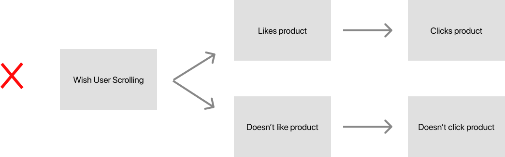
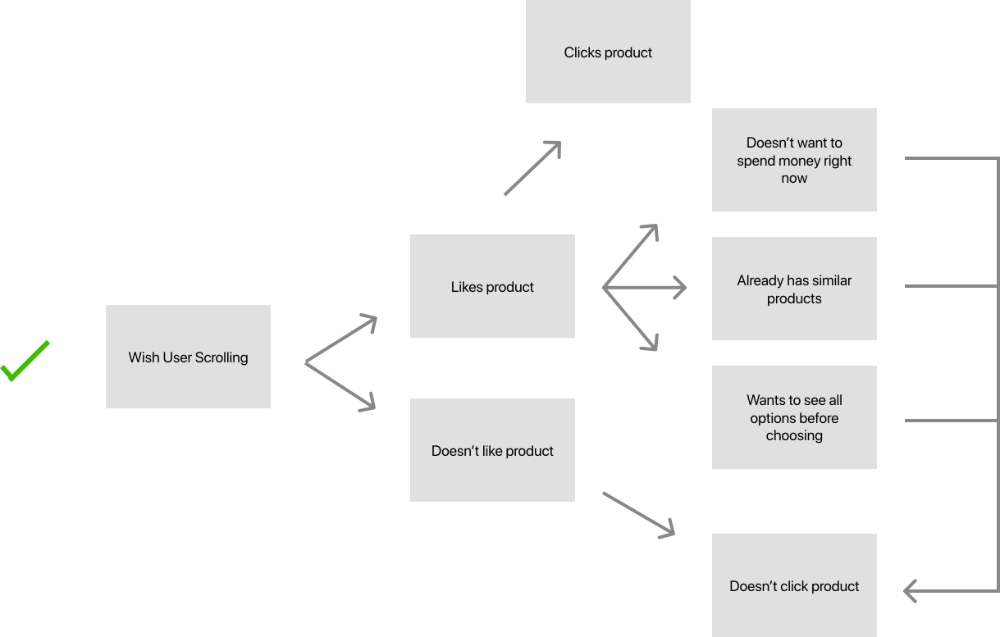
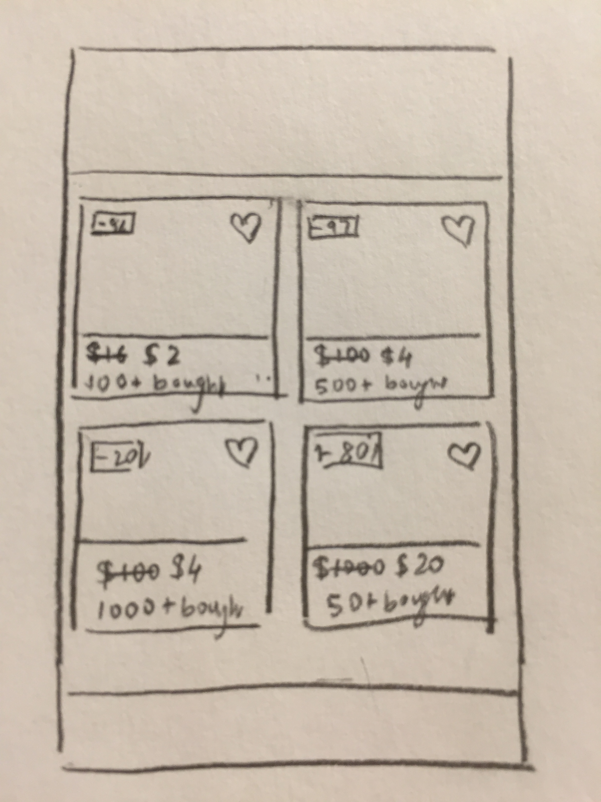
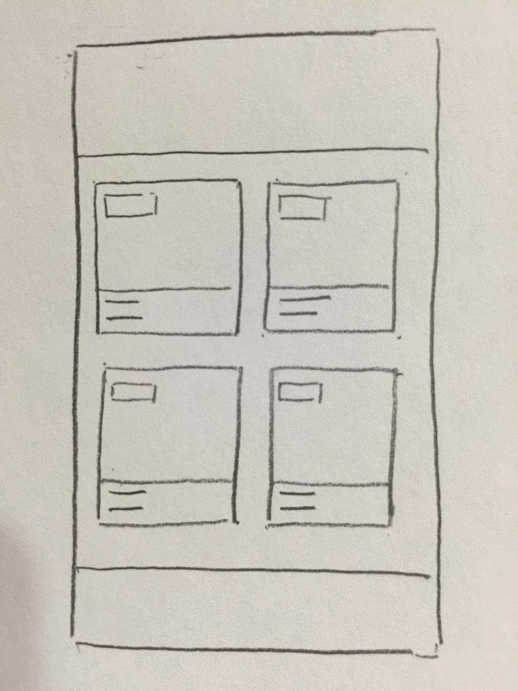
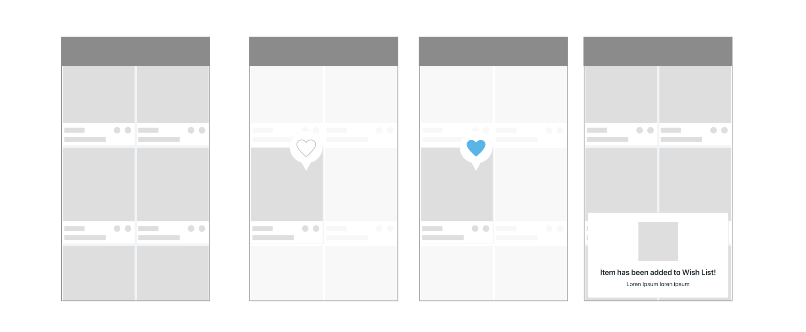

# Wish Design Challenge

Increasing sales through design

# Research

---

I interviewed and observed users to gain insights into some problems with the Wish app. Here is what I learned:

1. Click behavior was not predictable.
2. Several users remarked "I like these", "I would buy these", and "I would buy that too" in quick succession, without clicking any products.
3. One user mentioned "On Amazon, I open up products I like in different tabs. I won't look at them right away. But I'll get back to them once I'm done scrolling." This is not possible on mobile.

# Problem

---

Wish does not let users online shop the way they actually online shop. 

Below is the way Wish assumes users shop, as implied through its interface.

Below is the way users actually shop.

# Analysis

---

There are a lot of reasons users don't click a product even though they might like it. This is an intermediary state between "viewing product" and "buying product" ~~called~~ "interested in product". We need to let users express their intention of being interested, without committing to buying.

Wish has already implemented this functionality through the Wish List, but users can only add to Wish list after clicking on a product. Clicking is too much effort for the user and breaks their mental model of being in the "shopping mode" rather than the "evaluating mode". How can we let users express interest without clicking on a product?

Simple: we let users add to Wish List from the category pages itself.

# Impact

---

Let's look at it how this feature can impact sales.

- Wish users can revisit products they found interesting before, when they finally have the money or have made up their mind. Easier access to products users like ⇒ more sales.

- Wish users will have a better scrolling experience, making them  scroll for longer. More scroll time ⇒ exposure to more products ⇒ more sales.

- Wish can collect more refined data on products a user finds interesting. This data was previously lost because users didn't always click on a product they liked. In e-commerce, more data ⇒ more personalization ⇒ more sales.

# Sketches

---

Convinced by my analysis, I began exploring implementations.

There are two possible implementations: a "hidden interaction" and a "visible interaction". My intuition was that a hidden interaction will be more suited for this feature, but I explored both options.

Visible:

Hidden:

# Final Designs

---

Below is the final design that I came up with after a few iterations. I will explain the design decisions in my phone interview.

